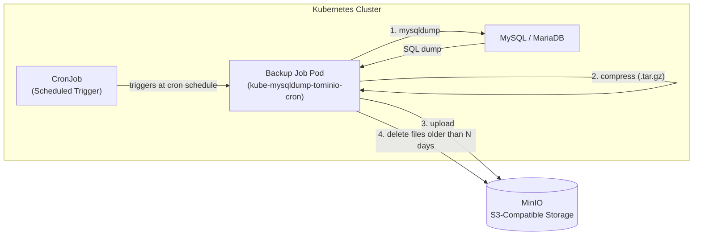
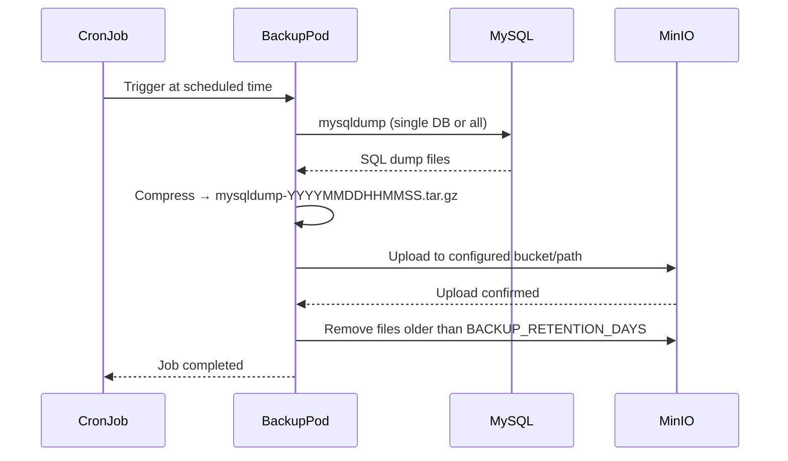
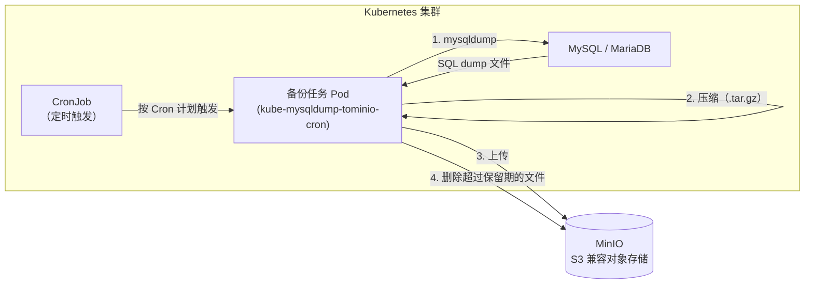
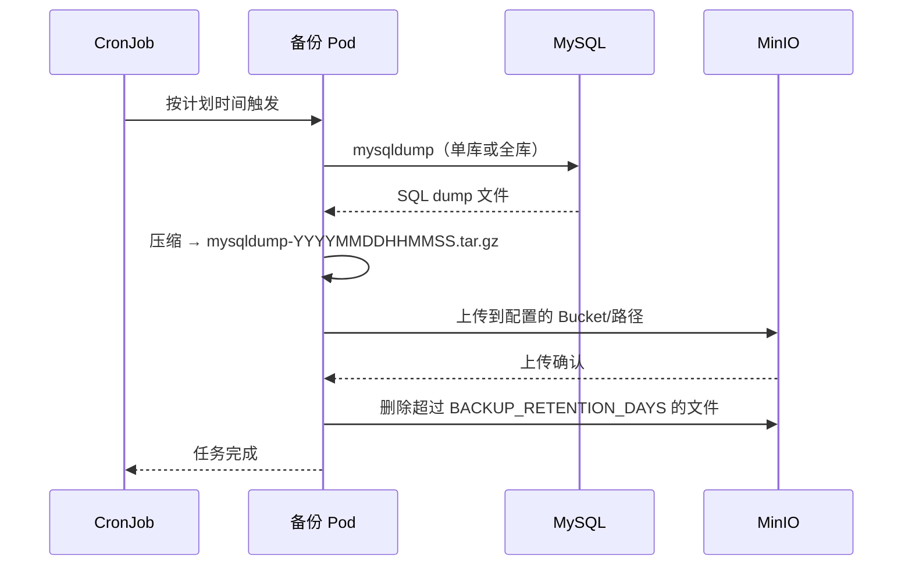

# kube-mysqldump-tominio-cron

[](https://hub.docker.com/r/cdryzun/kube-mysqldump-tominio-cron)
[](https://hub.docker.com/r/cdryzun/kube-mysqldump-tominio-cron)
[](LICENSE)
[](https://github.com/cdryzun/kube-mysqldump-tominio-cron)

**Automated MySQL backup to MinIO, running as a Kubernetes CronJob.**
No extra operators, no sidecars — just a single image with `mysqldump` + `mc`.

[English](#english) | [中文](#中文)

---

## English

### Why this project?

Most MySQL backup solutions for Kubernetes are either too heavy (custom operators, CRDs) or too fragile (shell scripts without retention). This project gives you a production-ready backup pipeline in under 5 minutes:

- **One image** — Alpine-based, ~50 MB, amd64 + arm64
- **One command** — Helm install with your credentials
- **One concern** — Backups land in MinIO and old ones are cleaned up automatically

### Features

- **Automated Scheduling** — Kubernetes CronJob with configurable timezone
- **Flexible Scope** — Single database or all databases (`--all-databases`)
- **S3-Compatible Storage** — Works with MinIO, AWS S3, or any S3-compatible backend
- **Automatic Retention** — Configurable cleanup (default: 7 days)
- **Notification Support** — Slack, DingTalk, and generic webhooks
- **Helm Chart** — Values-driven, supports existing Secrets

### Architecture


```mermaid
graph LR
    subgraph k8s["Kubernetes Cluster"]
        cj["CronJob\n(Scheduled Trigger)"]
        bj["Backup Job Pod\n(kube-mysqldump-tominio-cron)"]
        mysql["MySQL / MariaDB"]
    end

    minio[("MinIO\nS3-Compatible Storage")]

    cj -->|"triggers at cron schedule"| bj
    bj -->|"1. mysqldump"| mysql
    mysql -->|"SQL dump"| bj
    bj -->|"2. compress (.tar.gz)"| bj
    bj -->|"3. upload"| minio
    bj -->|"4. delete files older than N days"| minio
```

### Backup Workflow


```mermaid
sequenceDiagram
    participant CronJob
    participant BackupPod
    participant MySQL
    participant MinIO

    CronJob->>BackupPod: Trigger at scheduled time
    BackupPod->>MySQL: mysqldump (single DB or all)
    MySQL-->>BackupPod: SQL dump files
    BackupPod->>BackupPod: Compress → mysqldump-YYYYMMDDHHMMSS.tar.gz
    BackupPod->>MinIO: Upload to configured bucket/path
    MinIO-->>BackupPod: Upload confirmed
    BackupPod->>MinIO: Remove files older than BACKUP_RETENTION_DAYS
    BackupPod-->>CronJob: Job completed
```

### Quick Start

#### Option 1: Helm (Recommended)

```bash
helm install mysql-backup ./charts/kube-mysqldump-tominio-cron \
  --set mysql.host=mysql-server \
  --set mysql.user=root \
  --set mysql.password=your-password \
  --set minio.server=http://minio:9000 \
  --set minio.accessKey=minio \
  --set minio.secretKey=minio123 \
  --set minio.bucket=mysql-backups
```

#### Option 2: kubectl

```bash
kubectl apply -f test/backup-job.yaml
```

### Configuration

#### Environment Variables

| Variable | Required | Default | Description |
|----------|:--------:|---------|-------------|
| `DB_HOST` | Yes | — | MySQL host address |
| `DB_USER` | Yes | — | MySQL username |
| `DB_PASS` | Yes | — | MySQL password |
| `DB_NAME` | No | — | Target database (single-DB mode) |
| `ALL_DATABASES` | No | — | Set `"true"` to dump all databases |
| `IGNORE_DATABASE` | No | — | Database name to exclude |
| `MINIO_SERVER` | Yes | — | MinIO server URL |
| `MINIO_ACCESS_KEY` | Yes | — | MinIO access key |
| `MINIO_SECRET_KEY` | Yes | — | MinIO secret key |
| `MINIO_BUCKET` | Yes | `mysql-backups` | Bucket name or bucket/prefix path |
| `MINIO_API_VERSION` | No | `S3v4` | MinIO API version |
| `BACKUP_RETENTION_DAYS` | No | `7` | Days to retain backups |

#### Kubernetes Manifest Example

```yaml
apiVersion: batch/v1
kind: CronJob
metadata:
  name: mysqldump
spec:
  schedule: "0 4 * * *"   # Daily at 04:00 AM
  timeZone: "Asia/Shanghai"
  failedJobsHistoryLimit: 1
  successfulJobsHistoryLimit: 3
  jobTemplate:
    spec:
      template:
        spec:
          containers:
          - name: mysqldump
            image: cdryzun/kube-mysqldump-tominio-cron:latest
            env:
            - name: DB_HOST
              value: "mysql-server"
            - name: DB_USER
              value: "root"
            - name: DB_PASS
              valueFrom:
                secretKeyRef:
                  name: mysql-secret
                  key: password
            - name: ALL_DATABASES
              value: "true"
            - name: MINIO_SERVER
              value: "http://minio:9000"
            - name: MINIO_ACCESS_KEY
              valueFrom:
                secretKeyRef:
                  name: minio-secret
                  key: access-key
            - name: MINIO_SECRET_KEY
              valueFrom:
                secretKeyRef:
                  name: minio-secret
                  key: secret-key
            - name: MINIO_BUCKET
              value: "mysql-backups/production"
            volumeMounts:
            - mountPath: /mysqldump
              name: mysqldump
          volumes:
          - name: mysqldump
            emptyDir: {}
          restartPolicy: OnFailure
```

#### Using Existing Secrets (Helm)

```yaml
mysql:
  existingSecret: my-mysql-secret
  existingSecretUsernameKey: username
  existingSecretPasswordKey: password

minio:
  existingSecret: my-minio-secret
  existingSecretServerKey: server
  existingSecretAccessKeyKey: access_key
  existingSecretSecretKeyKey: secret_key
  existingSecretBucketKey: bucket
```

### Operations

#### Manual Backup

```bash
kubectl create job --from=cronjob/mysqldump manual-backup-$(date +%s)
```

#### Restore from Backup

```bash
# Download from MinIO
mc cp minio/mysql-backups/mysqldump-20240101120000.tar.gz .

# Extract
tar -xzf mysqldump-20240101120000.tar.gz

# Restore
mysql -h <host> -u <user> -p < mysqldump/database_name.sql
```

### Development

```bash
# Build locally
docker build -t kube-mysqldump-tominio-cron:dev ./Docker

# Test with docker-compose
docker-compose -f test/docker-compose.yaml up
```

### Contributing

Contributions are welcome. Please read the [Contributing Guide](CONTRIBUTING.md) before submitting a PR.

### License

MIT — see [LICENSE](LICENSE).

---

## 中文

**在 Kubernetes 中将 MySQL 自动备份到 MinIO 的 CronJob 方案。**
无需额外 Operator、无需 Sidecar——一个镜像集成 `mysqldump` 和 `mc`，5 分钟内完成部署。

### 为什么选择这个项目？

大多数 Kubernetes MySQL 备份方案要么太重（自定义 Operator、CRD），要么太脆弱（没有保留策略的裸 Shell 脚本）。本项目提供开箱即用的生产级备份流水线：

- **单一镜像** — 基于 Alpine，约 50 MB，支持 amd64 + arm64
- **一条命令** — Helm 安装，填入凭据即可
- **一个关注点** — 备份上传到 MinIO，旧备份自动清理

### 特性

- **自动调度** — Kubernetes CronJob，支持自定义时区
- **灵活粒度** — 单库备份或全库备份（`--all-databases`）
- **S3 兼容存储** — 支持 MinIO、AWS S3 及任何 S3 兼容后端
- **自动保留** — 可配置清理周期（默认 7 天）
- **通知支持** — Slack、钉钉、通用 Webhook
- **Helm Chart** — Values 驱动，支持复用已有 Secret

### 架构图


```mermaid
graph LR
    subgraph k8s["Kubernetes 集群"]
        cj["CronJob\n（定时触发）"]
        bj["备份任务 Pod\n(kube-mysqldump-tominio-cron)"]
        mysql["MySQL / MariaDB"]
    end

    minio[("MinIO\nS3 兼容对象存储")]

    cj -->|"按 Cron 计划触发"| bj
    bj -->|"1. mysqldump"| mysql
    mysql -->|"SQL dump 文件"| bj
    bj -->|"2. 压缩（.tar.gz）"| bj
    bj -->|"3. 上传"| minio
    bj -->|"4. 删除超过保留期的文件"| minio
```

### 备份工作流


```mermaid
sequenceDiagram
    participant CronJob as CronJob
    participant Pod as 备份 Pod
    participant MySQL as MySQL
    participant MinIO as MinIO

    CronJob->>Pod: 按计划时间触发
    Pod->>MySQL: mysqldump（单库或全库）
    MySQL-->>Pod: SQL dump 文件
    Pod->>Pod: 压缩 → mysqldump-YYYYMMDDHHMMSS.tar.gz
    Pod->>MinIO: 上传到配置的 Bucket/路径
    MinIO-->>Pod: 上传确认
    Pod->>MinIO: 删除超过 BACKUP_RETENTION_DAYS 的文件
    Pod-->>CronJob: 任务完成
```

### 快速开始

#### 方式一：Helm（推荐）

```bash
helm install mysql-backup ./charts/kube-mysqldump-tominio-cron \
  --set mysql.host=mysql-server \
  --set mysql.user=root \
  --set mysql.password=your-password \
  --set minio.server=http://minio:9000 \
  --set minio.accessKey=minio \
  --set minio.secretKey=minio123 \
  --set minio.bucket=mysql-backups
```

#### 方式二：kubectl

```bash
kubectl apply -f test/backup-job.yaml
```

### 配置说明

#### 环境变量

| 变量 | 必需 | 默认值 | 描述 |
|------|:----:|--------|------|
| `DB_HOST` | 是 | — | MySQL 主机地址 |
| `DB_USER` | 是 | — | MySQL 用户名 |
| `DB_PASS` | 是 | — | MySQL 密码 |
| `DB_NAME` | 否 | — | 目标数据库名（单库模式） |
| `ALL_DATABASES` | 否 | — | 设为 `"true"` 备份全部数据库 |
| `IGNORE_DATABASE` | 否 | — | 需要排除的数据库名 |
| `MINIO_SERVER` | 是 | — | MinIO 服务器 URL |
| `MINIO_ACCESS_KEY` | 是 | — | MinIO 访问密钥 |
| `MINIO_SECRET_KEY` | 是 | — | MinIO 密钥 |
| `MINIO_BUCKET` | 是 | `mysql-backups` | Bucket 名称或 Bucket/前缀路径 |
| `MINIO_API_VERSION` | 否 | `S3v4` | MinIO API 版本 |
| `BACKUP_RETENTION_DAYS` | 否 | `7` | 备份保留天数 |

### 运维操作

#### 手动触发备份

```bash
kubectl create job --from=cronjob/mysqldump manual-backup-$(date +%s)
```

#### 从备份恢复

```bash
# 从 MinIO 下载备份
mc cp minio/mysql-backups/mysqldump-20240101120000.tar.gz .

# 解压
tar -xzf mysqldump-20240101120000.tar.gz

# 恢复
mysql -h <主机> -u <用户> -p < mysqldump/database_name.sql
```

### 开发

```bash
# 本地构建
docker build -t kube-mysqldump-tominio-cron:dev ./Docker

# 使用 docker-compose 测试
docker-compose -f test/docker-compose.yaml up
```

### 贡献

欢迎 PR！提交前请阅读[贡献指南](CONTRIBUTING.md)。

### 许可证

MIT — 详见 [LICENSE](LICENSE)。
