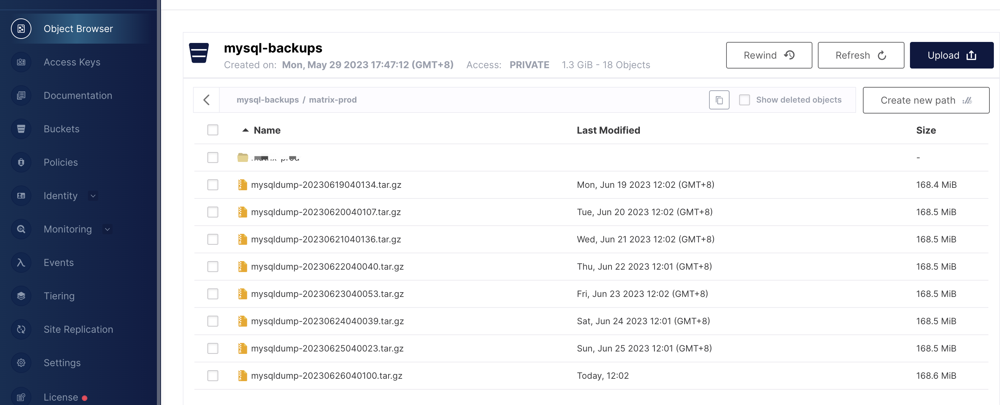

## Features

  * Schedule backup of MySQL database in Kubernetes and upload it to Minio. 


## How to use?

- K8S Deployment Yaml Manifest

  ```bash
  apiVersion: batch/v1beta1
  kind: CronJob
  metadata:
    name: mysqldump
  spec:
    schedule: 0 4 * * *
    failedJobsHistoryLimit: 1
    successfulJobsHistoryLimit: 3
    suspend: false
    jobTemplate:
      spec:
        template:
          spec:
            containers:
            - name: mysqldump
              image: cdryzun/kube-mysqldump-tominio-cron:v0.1.0
              env:
              # Injecting NAME_SPACE using Downward API
                - name: MYSQL_ENV_NAME_SPACE
                  valueFrom:
                    fieldRef:
                      fieldPath: metadata.namespace
                - name: ALL_DATABASES
                  valueFrom:
                    configMapKeyRef:
                      name: mysqldump
                      key: all_databases
                - name: DB_HOST
                  valueFrom:
                    configMapKeyRef:
                      name: mysqldump
                      key: dbhost
                - name: DB_USER
                  value: root
                - name: DB_PASS
                  valueFrom:
                    secretKeyRef:
                      name: mysql-server
                      key: mysql-root-password
                - name: MINIO_SERVER
                  valueFrom:
                    secretKeyRef:
                      name: miniocreds
                      key: MINIO_SERVER
                - name: MINIO_ACCESS_KEY
                  valueFrom:
                    secretKeyRef:
                      name: miniocreds
                      key: MINIO_ACCESS_KEY
                - name: MINIO_SECRET_KEY
                  valueFrom:
                    secretKeyRef:
                      name: miniocreds
                      key: MINIO_SECRET_KEY
                - name: MINIO_BUCKET
                  valueFrom:
                    secretKeyRef:
                      name: miniocreds
                      key: MINIO_BUCKET
              imagePullPolicy: Always
              volumeMounts:
                - mountPath: /mysqldump
                  name: mysqldump
            volumes:
              - name: mysqldump
                emptyDir: {}
            restartPolicy: OnFailure
  ---
  apiVersion: v1
  data:
    dbhost: "mysql-server"
    all_databases: "true"
  kind: ConfigMap
  metadata:
    name: mysqldump
  ---
  apiVersion: v1
  kind: Secret
  metadata:
    name: miniocreds
  type: Opaque
  stringData:
    MINIO_SERVER: http://oss.example.com:9000
    MINIO_ACCESS_KEY: root
    MINIO_SECRET_KEY: iexample
    MINIO_BUCKET: "mysql-backups/example-dev"
  ```

- `Apply using kubectl to the target cluster namespace`

  